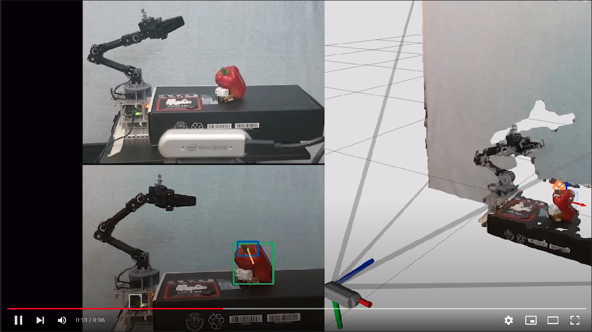

# RGBD Pepper Pose Estimation (ROS)

> ROS package for [this](https://github.com/lemontyc/rgbd-pepper-pose-estimation) project. It enables the sweet pepper detection framework to control the ROBOTIS OpenManipulator-X

This is a ROS package with multiple nodes. In brief, it enables support for extracting color 
and depth images from a live RealSense D435i camera, saves them to be processed by a Docker 
container (created [here](https://github.com/lemontyc/rgbd-pepper-pose-estimation)), then 
using the inferred bounding box coordinates of peduncles and peppers, it estimates the 
object's pose, which makes the end effector of the robot move towards the estimated pose.

## Watch it working!
[](https://www.youtube.com/watch?v=nKbfr0XxJEY&ab_channel=lemontyc)

## Main Scripts 

> scripts/

Scripts | Description
------- | -----------
image_extractor.py |  Extracts and publishes color and depth images from a RealSense D435i camera every 4 seconds.
inference.py | **Main** node. It is responsable for sending the images to the docker Mask R-CNN container and then creating 3D bounding boxes where peppers or peduncles were detected.
robot_mover.py | Using the 3D bounding boxes, it moves the robot's end-effector towards their estimated pose.

## Launch Files

> launch/

Launch Files | Description
------- | -----------
open_manipulator_d435i_rviz_inference.launch | Launches everything needed for inference and visualization. Robotic arm will try moving to home position at launch.
open_manipulator_d435i_rviz.launch | Launches only the rviz configuration and the RealSense d435i node. Robotic arm will try moving to home position at launch.
open_manipulator_upload.launch | Used for visualizing the urdf model in rviz of the OpenManipulator-X and the RealSense D435i
pepper_test.launch | Runs the image extractor node and the image inference nodes. 
robot_test.launch | Runs the robot mover node.
test_d435i.launch | Launches necessary nodes for the RealSense D435i camera.

No launch file will move the robot. It must be manually ran:
```sh
$ rosrun rgbd-pepper-pose-estimation-ros robot_mover.py
```


## Requirements

ROS dependencies should be installed with rosdep. Additional dependencies are:

* Python Realsense Library ([here](https://github.com/IntelRealSense/librealsense/tree/master/wrappers/python#installation)).


## Running
1. Download [this](https://github.com/lemontyc/rgbd-pepper-pose-estimation) repository to your computer. And run:
```sh
git clone https://github.com/lemontyc/rgbd-pepper-pose-estimation
cd rgbd-pepper-pose-estimation
git submodule update --init --recursive
```

2. Copy the contents of ``ROS/`` to your local ``<ROS_workspace/src>``, then:
```sh
catkin_make
source devel.setup.bash
```
3. Plugin the RealSense D435i camera and run:
```sh
roslaunch rgbd-pepper-pose-estimation open_manipulator_d435i_rviz_inference.launch
rosrun rgbd-pepper-pose-estimation-ros robot_mover.py
```

# More Information

For the Mask R-CNN container which includes this repository as a sub-module, as well as much more stuff, click [here](https://github.com/lemontyc/rgbd-pepper-pose-estimation).


## Meta

* **Luis M.**           - [GitHub](https://github.com/lemontyc)


Distributed under the MIT License. See ``LICENSE`` for more information.

This project was developed for the **Sweet Pepper Recognition and Peduncle Pose Estimation** masters thesis of Luis Montoya (@lemontyc) at **Tecnológico de Monterrey** from 2020 to 2021.